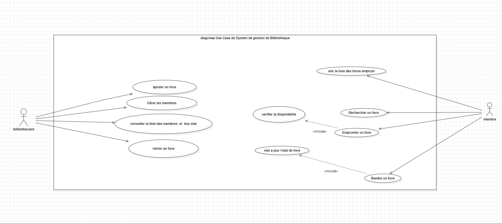
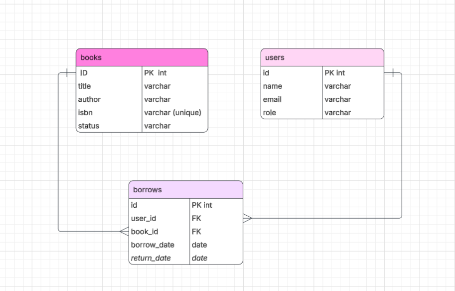

📚 Contexte du projet (LibCore)

L’association The Knowledge Hub gère ses livres avec Excel, mais ce n’est pas efficace.

On doit créer LibCore, une application plus intelligente en PHP.

👉 Idée principale :

Chaque livre est un objet intelligent (il sait s’il est disponible ou non)
Chaque action est contrôlée (ex : un membre inactif ne peut pas emprunter)
👥 Les acteurs
Bibliothécaire (admin du système)
Membre (utilisateur des livres)
Étudiant
Professeur
🧑‍💻 Rôles du bibliothécaire (Admin)
➕ Ajouter des livres (titre, auteur, ISBN)
👤 Créer des comptes membres
📊 Voir tous les livres et leur état (disponible, emprunté, perdu)
🛠️ Retirer ou mettre un livre en réparation
📖 Rôles du membre
🔎 Rechercher un livre
📥 Emprunter un livre (si disponible)
📤 Rendre un livre
📋 Voir ses livres empruntés
⚙️ Règles importantes du système
Un livre ne peut être emprunté que s’il est disponible
Un membre doit être actif
Encapsulation obligatoire : toutes les propriétés sont privées
Utilisation de POO (classes, objets, héritage)
🧱 Structure du projet

Le projet est organisé comme ça :

Entities/ → classes principales (Book, User, Member…)
Services/ → logique métier (Library : emprunt, retour…)
mainAdmin.php → interface bibliothécaire
mainMember.php → interface membre
docs/ → diagrammes UML

.env → configuration
README.md → explication du projet
👨‍🏫 Types de membres (bonus)
Student → max 3 livres
Teacher → max 10 livres

👉 Cela montre l’héritage et les règles différentes selon les utilisateurs.

🧠 UML (modélisation)
Use Case :
Ajouter livre
Gérer membres
Emprunter livre
Rendre livre
Classes :
Library (système principal)
Book
User
Member
Librarian

Relations :

Member + Librarian héritent de User
Library contient Books + Users
Member possède plusieurs Books
🚀 Objectif pédagogique

Apprendre :

Programmation Orientée Objet (POO)
PHP 8
Encapsulation, héritage
Gestion propre d’un projet backend
UML (diagrammes)
SQL / PDO (si base de données)
⏳ Organisation
Travail en binôme
Durée : 5 jours
Présentation finale + démo + code review + questions
